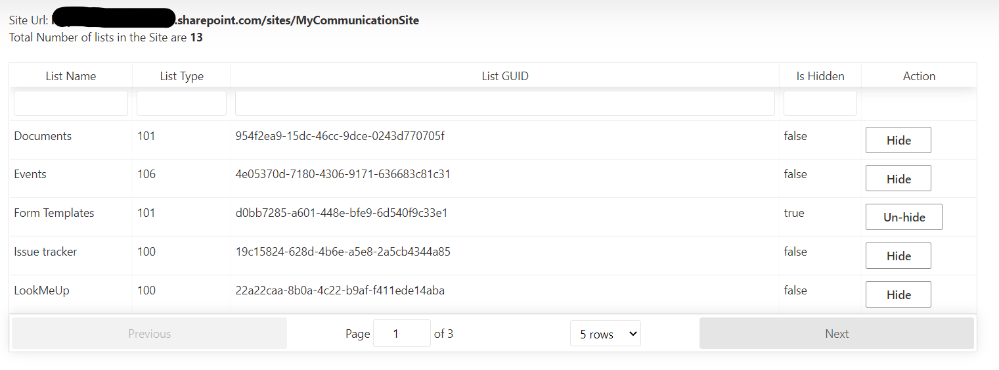
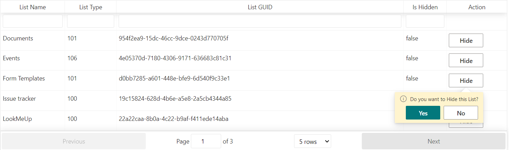

# hide-lists-wp

## Summary

SPFx Webpart to Hide/UnHide lists in a Site Collection

## Used SharePoint Framework Version

## Applies to

- [SharePoint Framework](https://aka.ms/spfx)
- [Microsoft 365 tenant](https://docs.microsoft.com/en-us/sharepoint/dev/spfx/set-up-your-developer-tenant)

> Get your own free development tenant by subscribing to [Microsoft 365 developer program](http://aka.ms/o365devprogram)

## Prerequisites

> Access to SharePoint Site

## Solution

Solution|Author(s)
--------|---------
src| Sandeep Unnikrishnan

## Version history

Version|Date|Comments
-------|----|--------
1.0|February 27, 2022|Working Version

## Disclaimer

**THIS CODE IS PROVIDED *AS IS* WITHOUT WARRANTY OF ANY KIND, EITHER EXPRESS OR IMPLIED, INCLUDING ANY IMPLIED WARRANTIES OF FITNESS FOR A PARTICULAR PURPOSE, MERCHANTABILITY, OR NON-INFRINGEMENT.**

---

## Minimal Path to Awesome

- Clone this repository
- Ensure that you are at the solution folder
- in the command-line run:
  - **npm install**
  - **Update your SharePoint Site Url in serve.json**
  - **gulp serve**

## Features

As Site Admins we may need to hide some lists or libraries from other users who have access to the lists/libraries.

For example: we may have created a PowerApps form and need to hide master lists or Logs list which has to be kept hidden from end users though they have Read permissions or Edit permissions to the lists/libraries.

Here we will be achieving the same functionality using SPFx Webpart, which we can just add to a Site Collection and it will list out the lists and libraries in the site and Site Admin can Hide/Unhide lists with a simple button click.

## References

- [Getting started with SharePoint Framework](https://docs.microsoft.com/en-us/sharepoint/dev/spfx/set-up-your-developer-tenant)
- [List Template Types](https://docs.microsoft.com/en-us/previous-versions/office/sharepoint-visio/jj245053(v=office.15)?redirectedfrom=MSDN)
- [Fluent UI Controls](https://developer.microsoft.com/en-us/fluentui#/controls/web/callout)